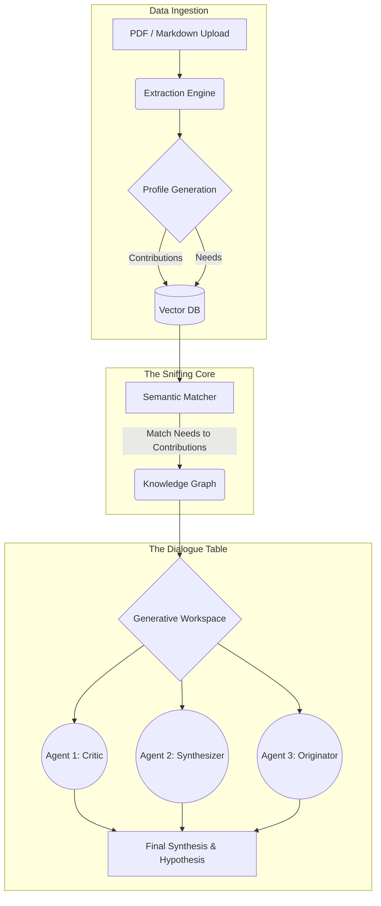

# 2. High-Level Architecture

The Sniffing platform is built upon a modern, modular architecture designed to extract, vectorize, and connect scientific knowledge dynamically. To protect proprietary methodologies, this document provides a high-level overview of the system's core capabilities.

## System Overview

## Core Modules

### 1. Ingestion & Extraction Engine
When a document is uploaded, the system parses it and extracts its core structural components rather than just indexing its text. It identifies the study's domain, methodology, results, and crucially, its limitations and open questions.

### 2. Vector Database & Semantic Matcher
The extracted components are converted into high-dimensional vector embeddings using advanced NLP models. This allows the system to perform similarity searches based on deep meaning rather than literal keywords. The "Sniff" algorithm specifically queries the database by matching a document's *Knowledge Needs* against the entire corpus's *Contributions*.

### 3. Interactive Knowledge Graph
The relationships discovered by the semantic matcher are visualized in an interactive 3D WebGL graph. Users can navigate this constellation of knowledge, exploring clusters, isolated concepts, and cross-disciplinary bridges.

### 4. Multi-Agent Generative System
The pinnacle of the architecture is the Dialogue Table. When an interesting connection is found in the graph, it is sent to a multi-agent system powered by LLMs. These agents take on distinct personas and debate the connection, resolving epistemic tensions and drafting new, synthesized hypotheses.
