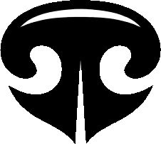
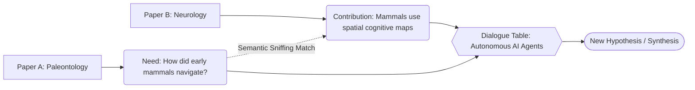
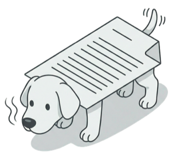
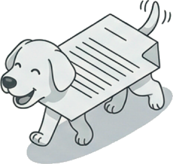
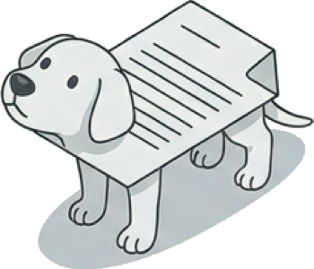

# Sniffing: Generative Research Engine

Welcome to the official documentation repository for **Sniffing**, a next-generation visual and generative research engine.

🌐 **Live Project:** [sniffing.vercel.app](https://sniffing.vercel.app)

---

## 🐶 What is Sniffing?

Today, building a visual knowledge graph is no longer the final goal, but merely the starting point. Sniffing leaps beyond traditional visual exploration.

Instead of just linking papers that cite each other, Sniffing works by strictly connecting **Knowledge Needs** from one discipline with **Contributions** from another through deep semantic vector matching. Once a connection is discovered ("sniffed"), a live **Dialogue Table** of autonomous AI agents debates the intersection to generate entirely new hypotheses and solutions.

### The "Sniff" Connection

## 📂 Documentation Structure

This repository is organized to help researchers, developers, and investors quickly find the information they need:

- **📁 [1_Concept](./1_Concept/Concept_and_Value.md):** The problem of information overload, the core Sniffing solution, and its value proposition for investors and researchers.
- **📁 [2_Architecture](./2_Architecture/High_Level_Architecture.md):** High-level technical overview of the ingestion pipeline, semantic matcher, and the multi-agent generative workspace.
- **📁 [3_Roadmap](./3_Roadmap/Future_Roadmap.md):** The consolidated future steps, including the v2 Self-Service platform and advanced collaborative AI agents.
- **📁 [4_Research](./4_Research/Bibliography.md):** The academic context and foundational theories supporting the Sniffing methodology (Scientometrics, Information Overload, Lateral Thinking).

## 🐾 Meet the "Gossos-Paper" (Paper-Dogs)

The soul of Sniffing is represented by our search agents, affectionately known as the "paper dogs". They navigate the vast landscape of human knowledge, sniffing out connections where no one else looks.

  
  
  

## 👤 About the Creator

**Bernat Sanromà**  
*Strategic Consultant | University Professor | Specialist in Storytelling, Creativity, and Lateral Thinking*

Sniffing is born not from traditional engineering or academic orthodoxy, but from a purely lateral thinking perspective aimed at breaking down information silos.

Bernat is also the developer of **My-Eutic** ([www.my-eutic.org](https://www.my-eutic.org)), an educational tool designed to restore critical thinking in students.

---

*This project is currently in active development. We welcome feedback, ideas, and collaborations!*
